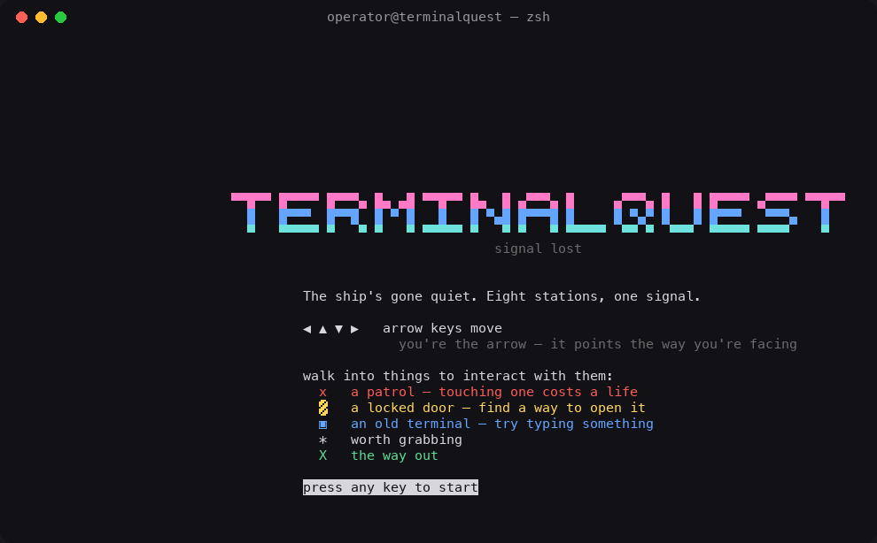
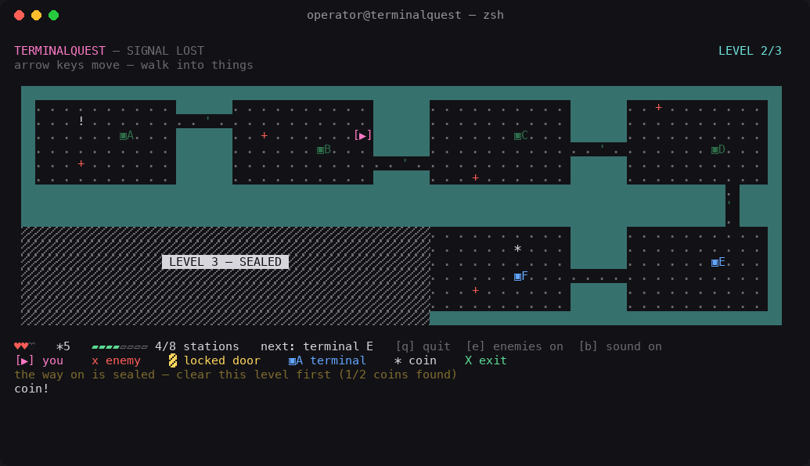
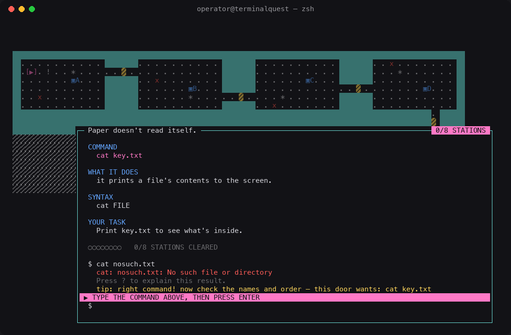
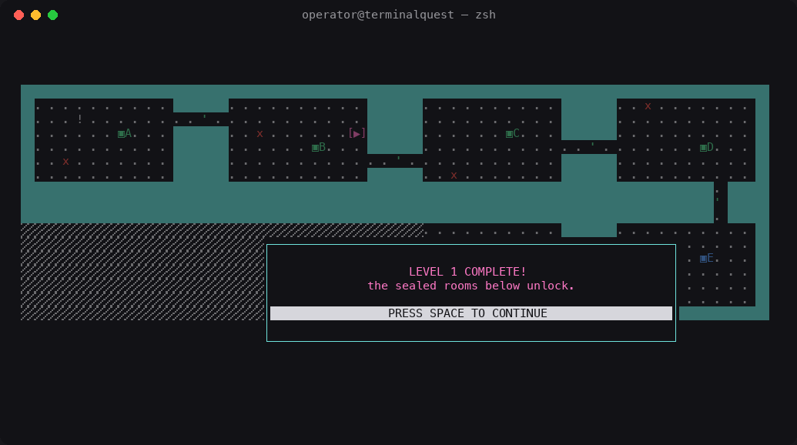
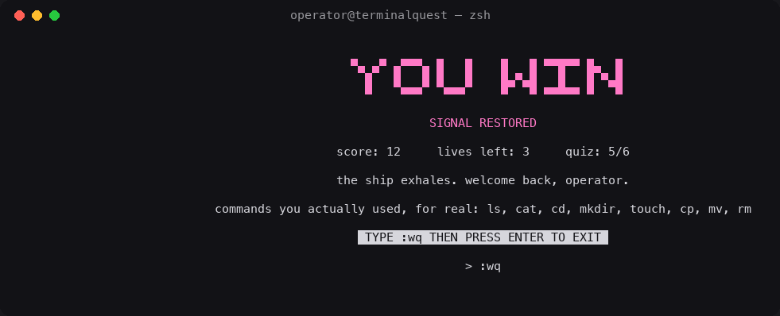

# TerminalQuest — Signal Lost

[](https://github.com/sarangrakhecha/TerminalQuest/actions/workflows/tests.yml)

**Learn the terminal by saving a ship — not by reading slides.**

A tiny real-time arcade game that teaches you the terminal by making you
actually use it.

No slides, no lectures. You move around a ship with arrow keys,
dodge patrolling enemies, and every so often walk up to an old computer.
It drops you into a **real bash prompt**. Whatever you type actually runs,
starting in a scratch folder on your machine. Get it right, and something
in the world reacts — a door unlocks, a gate opens, a locked room stops
being locked. After each level there's an optional 3-question recap quiz to
help it stick — take it or skip it.

**8 commands · 8 stations · 3 levels · 502 automated tests · zero dependencies**

## Contents

- [Why this exists](#why-this-exists)
- [How the game works](#how-the-game-works)
- [What it looks like](#what-it-looks-like)
- [The map](#the-map)
- [Levels, gates, and masking](#levels-gates-and-masking)
- [Install & run](#install--run)
- [Controls](#controls)
- [How it's built](#how-its-built)
- [Design philosophy](#design-philosophy)
- [Safety boundary](#safety-boundary)
- [Project layout](#project-layout)
- [Testing](#testing) — what's actually covered
- [Design rules for contributors](#design-rules-read-this-before-opening-a-pr)
- [Reporting a bug](#reporting-a-bug)
- [Contributing](#contributing)
- [License](#license)

## Why this exists

School (and every bootcamp, tutorial, and AI assistant since) is great at
teaching you *how to code*. Almost nobody teaches you the terminal itself —
`ls`, `cd`, `cat`, `mkdir`, `mv`, `rm` — the stuff you type dozens of times
a day. Most people pick it up the slow way: one Googled error message at a
time, over months.

AI has made looking things up faster. It hasn't made knowing the basics
by heart any less useful — that's still the difference between moving
through your work and constantly stopping to look something up.

TerminalQuest is a small attempt at fixing that the fun way: instead of a
tutorial, a game where the "puzzle" at every station is solved by typing one
real command, in a real shell, with real consequences (a real file gets
created, moved, or deleted) — not a simulated, multiple-choice version of it.

## How the game works

```
WALK THE SHIP → FIND A TERMINAL → READ THE PANEL → RUN THE COMMAND → SOMETHING UNLOCKS
```

Every terminal shows exactly what you need and nothing more:

1. **COMMAND** — the exact command being taught.
2. **WHAT IT DOES** — one short, plain-language explanation.
3. **SYNTAX** — including argument roles like `SOURCE`, `DESTINATION`, `FILE`.
4. **YOUR TASK** — the concrete, observable thing you need to produce.

You have to type it yourself — there's no autofill. After running
something, `?` explains the result once, on request — it never becomes a
mandatory screen you have to click past, and it correctly recognizes a
*failed* command as a failure instead of explaining it as if it had worked.

### The optional recap quiz

When you clear a level (and again when you reach the exit) the game offers a
quick **3-question recap** of what that level taught: press `Y` to take it or
`N` to skip and carry on. Nothing depends on it.

- Each level has its own pool of questions; **3 are drawn at random** every
  time, so a replay isn't the same quiz.
- Most are **"type it" questions**: your answer runs as real bash in a
  throwaway folder and is graded on the *result*, so any command that gets
  there counts (`mkdir -p photos` is as good as `mkdir photos`).
- The rest are **pick a number** questions, with the options shuffled.
- **First wrong answer:** you get a hint (and bash's real error message, if
  there was one) and one more try. **Second wrong answer:** the answer is
  shown and you move on.
- It never costs a life or blocks progress; your running quiz score shows on
  the win screen if you took any.

### Helping you along

- **Coaching tips.** Miss a station twice and the panel adds one line saying
  what was off — a typo'd command name (*"did you mean `cp`?"*), the right
  command with the wrong names, or a totally different command. It never
  gives a new answer (the COMMAND box always shows it) and never costs
  anything.
- **Map cues.** Every terminal on the map carries its station letter and dims
  once solved, and the HUD always says which terminal is next.
- **Learn mode.** `--no-enemies` (or `e` in game) switches the patrols off.
- **A cheat sheet at the end.** When the game closes, the 8 commands with an
  example each are printed into your shell — ticked if you used them — so the
  takeaway is right there to copy from.

## What it looks like

These are rendered directly from the game's own drawing code (not mockups)
— what you'd actually see in a terminal.

**The title screen** — big letters built from half-block characters, so each
"pixel" comes out square:



**The overworld** — teal walls, hatched fog over levels you haven't reached,
a live HUD (lives, coins, a progress bar, the next terminal), and a legend
colored to match the map:



**A station** — the command panel is always on screen, never a one-time
card that vanishes after your first visit:



**Clearing a level** — a deliberate beat, not a screen you blink and miss:



**Finishing the game** — the same block letters, and a prompt that answers
you if you type the wrong thing:



## The map

Eight rooms, one command each, laid out as two rows connected by a shaft —
right along the top, down, then back along the bottom. Every door sits at
its own row — top, middle, or bottom of the room it guards — so the path
actually bends instead of reading as one straight corridor you can walk
without looking:

```
######################################################
#..........####..........####..........####..........#
#.>.!..*.....+...........####..........####...*......#
#......@...####..........####......@...####..........#
#..........####......@...#*##............+.......@...#
#..........####......*.....+....*......####..........#
#..........####..........####..........####..........#
##################################################.###
##################################################+###
##################################################.###
#.#........####..........####..........####..........#
#.#......!.####...........+........*...####..........#
#.#........####......@...####..........####......@...#
#X+....@...#+##..........####......@.................#
#.#......................####..........#+##..........#
#.#........####..........####..........####..........#
######################################################
```

(`@` a terminal, `!` a sign, `*` a coin, `+` a door, `>` the start, `X` the
exit — the actual game draws these in color, with locked/unlocked doors
looking distinct, patrolling enemies, and a facing arrow for the player.)

## Levels, gates, and masking

The eight rooms are split into **three levels**:

- **Level 1** — rooms A, B, C, D (top row)
- **Level 2** — rooms E, F
- **Level 3** — rooms G, H (no coin gate — clear both stations, then collect any coins you skipped and walk out)

A level you haven't reached yet renders as a solid sealed block labeled
**LEVEL n — SEALED**. While neither of the two remaining levels has been
reached, they read as *one* sealed area instead of two separate labels
crammed side by side — that's deliberate, not a rendering bug.

Clearing a level means clearing *every* one of its stations **and**
collecting *every* one of its required coins — not just solving the last
terminal. Do that and a "LEVEL COMPLETE — well played" screen pops up, with
its own highlighted `PRESS SPACE TO CONTINUE` bar. It waits for that
specific key on purpose: an earlier version dismissed on *any* key, which
meant it could vanish inside a single frame if you were still holding an
arrow key from walking into the last coin.

**All eight coins are required to leave.** The two coins that aren't needed
to clear a level (one in room H, one in a hidden closet) are still
mandatory for the win. Walk into `X` with any missing and a **SIGNAL
INCOMPLETE** message tells you how many are left; you stay outside the exit
until you've collected them all.

A level you've already cleared **stays visible for good** — it never goes
back under fog behind you. Finish all three and a big block-letter banner
spells out the win, right on the terminal.

## Install & run

Requires **Python 3.9+**, Bash, and a real terminal window with `curses`
support, at least **112×28** characters (if you see a resize prompt, just
enlarge the window; the game checks its size every frame, so shrinking and
regrowing the window mid-game is safe too). No `pip install` needed to
play — `curses` ships with Python.

```bash
python3 terminalquest.py
```

**Windows:** native Windows terminals don't support `curses`. Run it inside
[WSL](https://learn.microsoft.com/windows/wsl/) with Python 3 installed
instead.

Everything the game creates lives under `~/TerminalQuest_Arcade` — a real
folder on disk, one subfolder per station. Every launch starts a fresh
campaign (progress isn't saved) and rebuilds the training folders; `--reset`
additionally deletes the whole game folder:

```bash
python3 terminalquest.py --reset
```

**Learn mode:** patrols can cost a life while you're trying to read a lesson.
Start with them off, or toggle them any time with `e` on the map:

```bash
python3 terminalquest.py --no-enemies
```

To put that folder somewhere else entirely:

```bash
TERMINALQUEST_ROOT=/path/to/somewhere python3 terminalquest.py --reset
```

## Controls

| Context | Key | Does |
|---|---|---|
| Overworld | Arrow keys | Move — walk into things to interact with them |
| Overworld | `q` | Quit (asks `Y`/`N` first, so a stray key can't end your run) |
| Overworld | `e` | Turn patrols off/on (learn mode) |
| Overworld | `b` | Turn the solve bell on/off |
| Overworld | `t` | Toggle high-contrast mode (bold/reverse/underline, no color) |
| At a terminal | *(typing)* | A real bash prompt — nothing is simulated |
| At a terminal | `Enter` | Run the line |
| At a terminal | `?` | Explain the last result (once something's been run) |
| At a terminal | `Esc` | Clear the line, or leave if it's already empty |
| Anywhere | *(resize the window)* | The game repaints; below 112×28 it asks you to enlarge it, then carries on |
| Level-complete screen | `Space` | Continue — shown as its own highlighted bar so it's easy to spot |
| The final "you win" screen | `:wq` then `Enter` | The only way out, once the game's actually over |

| Symbol | Meaning |
|---|---|
| `[▶] [▲] [▼] [◀]` | You — the arrow sits between brackets and points the way you're facing |
| `x` | A patrol — touching one costs a life |
| `▓` | A locked door |
| `'` | An unlocked door |
| `▣A` … `▣H` | An old terminal, labeled with its station letter (solved ones dim out); the HUD says which one is next |
| `*` | Worth grabbing |
| `!` | A sign |
| `X` | The way out |

## How it's built

- **Every room is a real directory.** The overworld map is an in-memory
  grid, but each station's "puzzle" is a real folder under
  `~/TerminalQuest_Arcade/puzzles/`, and every command you type at a
  terminal runs through actual `/bin/bash`.
- **Game logic is UI-free.** The `Game` class in `terminalquest.py` has no
  `curses` in it at all — it's plain Python state plus real subprocess
  calls. The curses front-end (`draw_*` functions and `main()`) is a thin
  layer on top that only renders and reads keys. That split is what makes
  the test suite (and the screenshots above) possible without a real
  terminal.
- **Setup is repair-on-launch, not run-once.** Each station's starting
  files are (re)created from a per-station marker the first time that
  marker is missing — not just "if the folder doesn't exist" — so a folder
  that got deleted, or never finished setting up, gets fixed on the next
  launch instead of staying permanently broken. Real progress (files you've
  already renamed or removed) is never touched once that marker exists.
- **Resize-safe.** Every `draw_*` function tolerates a too-small or
  mid-resize terminal without crashing — `main()` re-checks the window size
  every frame and falls back to a "please resize" screen instead of raising.
  A resize is never mistaken for a keypress (it used to restart the game from
  the game-over screen), and it forces a full repaint.
- **Game time follows the clock, not the keyboard.** A fixed-timestep loop
  (10 ticks a second) drives enemies and timers. An earlier version ticked
  once per keypress, so holding an arrow key ran the world about 2.7x too
  fast. The loop also sleeps until the next tick is due, so an idle game uses
  about 0.5% of a CPU core.
- **Cheap frames.** The map is drawn a row at a time, merging neighbouring
  tiles that share a style into one write, so a frame is ~90 draw calls
  instead of ~930 (about a millisecond of Python). Door and zone lookups are
  precomputed tables rather than per-tile searches. A differential test checks
  the result is identical to drawing every tile separately.

## Design philosophy

- **Real outcomes, not answer matching.** Every station checks the actual
  filesystem after your command runs — a real file or folder has to exist,
  get renamed, or disappear. Nothing is pattern-matched against expected
  keystrokes.
- **Guidance without autopilot.** The panel shows the exact command; you
  still have to type it yourself. Nothing autofills it for you.
- **Explanation at the right moment.** `?` is available *after* you've
  done something, not forced on you before you're allowed to continue.
- **Progress without pressure.** No timers, no speed bonuses, no combo
  penalties, no typing races. Coins and levels exist for pacing, not score
  chasing — see the [design rules](#design-rules-read-this-before-opening-a-pr)
  on why there's no XP or achievement system.
- **Accessible by default.** High-contrast mode (`t`) uses bold, underline,
  and reverse video instead of relying on color alone.

## Safety boundary

TerminalQuest executes commands through your machine's real `/bin/bash`.
Commands run inside a disposable scratch folder, and a few guards catch the
accidents and jokes a curious learner might try:

- the working directory is checked after every command and snapped back if
  anything would escape it;
- `HOME` is pointed at the game folder for every command, so `cd`, `~` and
  `$HOME` land there and **`rm -rf ~` can't touch your real home directory**;
- any path that resolves outside the game folder — absolute paths like
  `/etc/passwd`, `..` climbs, `~`, symlinks — is refused with a friendly
  message, and a recursive `rm` aimed at the folder itself (or above it) is
  refused too;
- a small blocklist rejects `sudo`, `rm -rf /`, fork bombs, `dd` and `mkfs`;
- a command gets **no keyboard** (stdin is `/dev/null`), so a bare `cat` or
  `read` ends at once instead of swallowing your keystrokes;
- output goes to temp files and is capped — a command can't write more than
  1 MB (so `yes` and `yes > big.txt` are stopped by the OS), only the first
  64 KB is shown, and undecodable bytes become `�` instead of crashing;
- a command that runs past 10 seconds is stopped, and when any command ends
  its whole process group is killed, so a stray `sleep 99 &` can't linger.

**These are guardrails, not an operating-system security sandbox.** Command
substitution, shell variables and scripts can still get around them.

Do not:

- run it with administrator or root privileges;
- expose it as a public/shared shell;
- point it at a machine with sensitive data while testing adversarial input; or
- assume the guards can catch every possible destructive command.

For adversarial testing, use a disposable VM or container.

## Project layout

```text
terminalquest.py      game logic, the 8-station map, shell runner, and the curses UI
tests/test_game.py    the pytest regression suite (game logic, rendering, stations)  (120 tests)
tests/test_quiz.py    the pytest suite for the optional recap quiz (96 tests)
tests/test_ui.py      the curses-layer tests: colors, terminal panel, main() loop, the fixed-step clock, selftest (37 tests)
tests/test_features.py  learn mode, coaching tips, map cues, quit prompt, bell, cheat sheet, CI workflow, and gap-fillers for older code paths (162 tests)
tests/test_robustness.py  hostile input: command execution, the redesigned renderer, window resizes, and a seeded fuzzer (77 tests)
tests/test_pty_smoke.py   launches the real game in a pseudo-terminal: intro, quit, resize, Ctrl+C, held keys (10 tests)
screenshots/          images rendered from the game's own drawing code
README.md             this file
```

The game intentionally keeps logic separate from rendering — movement,
station checks, level gates, and shell execution are all testable without
launching an interactive terminal.

## Testing

```bash
pip install -r requirements-dev.txt
pytest
```

502 tests. Almost all run without a real terminal; a handful launch the actual game in a
pseudo-terminal. What's actually covered:

| Area | What's tested |
|---|---|
| `run_command` | The real-bash execution layer — commands actually shell out to `/bin/bash` from a temp folder, exactly like the live game |
| Map & tiles | Grid layout, wall/door/floor classification, that every room and door lines up |
| Movement | Walking, blocked-by-wall, blocked-by-locked-door, coin pickup, signs |
| Enemies | Patrol movement, collision costing a life, game over at 0 lives |
| Stations | All 8 stations, each solved by exactly one real command; wrong commands never solve anything, and a right command aimed at the wrong target (`mkdir mystuff` instead of `mkdir stash`) gets a nudge instead of a silent fail (including the ones solved by a file's *absence*, which is its own edge case); every launch starts a fresh campaign, so leftover files can't mark a station solved behind the game's back |
| Level gates | Both coin-gated levels require *both* conditions (last station solved **and** every coin collected) in either order; the gate that has no coin requirement; the `":wq"`-quit combo's matching logic |
| The lesson panel | COMMAND/WHAT IT DOES/SYNTAX/YOUR TASK content, `?`-to-explain (including that a *failed* command is recognized as an error and never explained as if it had succeeded) |
| Full playthrough | Every station in order, end to end, to the exit |
| Rendering | A `FakeScreen` stand-in renders `draw_base` and friends to plain text at an exact terminal size (including deliberately too-small ones), so a locked tile showing through, or a crash on a shrunk window, gets caught without a real terminal; covers the per-level fog/masking, the congrats screen, and the win banner |
| Recap quiz | Every question's own stated answer passes the real-bash grader, and no do-nothing command (`true`, `pwd`, `echo hi`) passes any typed question; choice questions have exactly one valid answer; 3 distinct questions drawn from the right level's pool, reproducible with a seed; skip / hint-then-retry / reveal-after-two-misses flow; never costs lives or score; key handling and every quiz screen at several window sizes |
| Curses layer | `setup_colors` (color, high-contrast, no-color and error paths); the terminal panel in every state at several sizes; the real `main()` loop driven by a scripted fake screen — intro, movement, signs, congrats, playing a station from the keyboard, game over, the `:wq`-then-Enter exit, and taking or declining the quiz; the built-in `selftest()` |
| Newer features | The `[▶]` player marker for every facing and at the map edge; learn mode (patrols freeze, don't hurt, aren't drawn; `--no-enemies` and `e`); station coaching tips (none after one miss, one after two, cleared on solve, never overriding the `mkdir`/`touch` target nudge); map cues (terminal letters, dimming when solved, "next terminal" in the HUD, no fog leaks); the quit prompt (`q` alone no longer quits); the solve bell (once per solve, silent when off, survives terminals that can't beep); the exit cheat sheet; and the CI workflow file itself |
| Resize safety | Every `draw_*` function is exercised at several window sizes — comfortably large, far too small, too narrow, too short — and must never raise; a resize is never treated as a keypress |
| Hostile commands | Binary and Unicode output, commands that read the keyboard, background jobs that outlive their command, runaway output, files that try to grow past the cap, timeouts and orphan cleanup |
| The renderer | Fog vs. walls, solved terminals, coin twinkle, the pulsing exit, the HUD (hearts, progress bar, level tag, legend colors), popups that stay framed and opaque, banners; a differential test that batched drawing equals tile-by-tile drawing |
| Fuzzing | Seeded random play through the real `main()` loop — random keys, typed commands (including hostile ones), resizes to random sizes — with invariants checked afterwards (lives in range, player never inside a wall, no exceptions) |
| Real pseudo-terminal | The actual game on a real pty: the intro waits for a key, start and quit exit 0 with the cheat sheet, shrinking and re-growing the window, resizing during the intro, Ctrl+C, a held key, idle output volume |
| Game clock | The fixed-step clock: no ticks before a step, one per step, capped catch-up after a stall, and — through the real loop — a held key adding no ticks |

Navigation in the tests uses `terminalquest.walk_to`, a small BFS
pathfinder, instead of hardcoded step counts — so if you rearrange a room or
move a door, the tests should keep passing without being touched.

Every push and pull request runs the whole suite on **macOS and Linux** across
**Python 3.9–3.12** via GitHub Actions (`.github/workflows/tests.yml`), with a
**90% coverage floor** and the built-in self-test.

### Real-terminal QA

Beyond the unit tests, the game was played in an actual pseudo-terminal with a
terminal emulator reading the screen: a complete run through all 8 stations
with real arrow-key escape sequences and typed commands (87 checks), random
keys and random window sizes from 3x20 up to 200x60, a 700-game offline fuzz
campaign (280,000 random keystrokes), the safety guards with a throwaway
`HOME`, and the command-line flags. Across the two passes this found and fixed:

- an intro screen that vanished after a tenth of a second;
- `rm -rf ~` slipping past the guard;
- Python tracebacks on Ctrl+C or with no terminal, and Esc taking a full
  second to register;
- a wrong `:wq` being silently ignored on the win screen;
- **non-UTF-8 command output crashing the whole game** with a traceback;
- **a bare `cat` freezing the game for 10 seconds** and eating the player's
  keystrokes (commands inherited the game's own keyboard);
- background jobs and runaway output (`yes`) holding the game up or growing
  without limit;
- **holding an arrow key running the world 2.7x too fast** (game time was
  tied to keypresses);
- **a window resize counting as a keypress**, restarting the game from the
  game-over screen and dismissing signs;
- a negative-width crash in the popup renderer on a tiny window.

### Quality approach

How the suite is designed, and what was run before this release:

- **Layered checks.** Unit-level tests for the shell layer, map, movement and
  enemies; state-machine tests for stations and level gates; an end-to-end
  playthrough; and rendering/resize tests. A failure points at one layer.
- **Real behavior, not mocks, where it matters.** Station checks run real
  `/bin/bash` commands from a temp folder, so a test passes only if the actual
  command produces the actual filesystem result.
- **Negative and edge cases.** Wrong commands never solve a station, gates need
  *both* conditions in either order, dangerous commands are blocked, the tracked
  working directory can't leave the game folder, and leftover files from a
  previous session can't solve a station.
- **Resilient to change.** Tests navigate with a BFS pathfinder (`walk_to`)
  rather than hardcoded step counts, so moving a door doesn't break them.
- **Fast and stable.** No network, and the few timing-sensitive checks use
  generous timeouts; the full suite runs in well under a minute, including the
  fuzz and real-terminal tests.
- **Release check.** Before the latest release: `pytest` → 502 passed,
  `python3 terminalquest.py --reset --selftest` → `SELFTEST PASSED`, run from a
  clean checkout with no stale `__pycache__`.

- **Measured coverage.** `pytest --cov=terminalquest --cov-branch` reports
  **98%** (1399 statements, 546 branches, 502 tests). The live curses `main()`
  loop is exercised by a scripted fake screen that feeds it real keypresses, so
  input handling is covered too. What's left is small: a few defensive
  branches, the subprocess-timeout path and the `__main__` entry point. Note
  the fake screen isn't a real terminal, so this measures which code runs, not
  how it looks on your screen.

There's also a lighter, dependency-free smoke test built into the game
itself, useful for a quick sanity check without installing anything:

```bash
python3 terminalquest.py --selftest
```

It drives a full playthrough of all 8 stations, the `?` terminal
affordance, the coin gates, and the win condition, headless.

## Design rules (read this before opening a PR)

This project is deliberately small, and stays that way on purpose:

- **The command set is fixed and tiny**: `ls`, `cd`, `cat`, `mkdir`, `touch`,
  `mv`, `cp`, `rm`. That's it for the base game. No `grep`, `find`, `sort`,
  `wc`, pipes, redirects, environment variables, permissions, or git — those
  are excellent commands and a terrible fit for a five-minute arcade game.
  If your PR teaches a 9th command, it needs a very good reason.
- **One command solves one station.** No multi-step assembly puzzles. The
  player should never sit at a prompt for more than a few seconds figuring
  out what to type.
- **The reference panel stays on screen.** Every terminal always shows
  COMMAND / WHAT IT DOES / SYNTAX / YOUR TASK — not a one-time card that
  disappears after your first visit. There's no autofill: you type the
  command yourself; `?` explains the last result once something's actually
  run.
- **No dependencies.** Python 3 standard library only (`curses` is built
  in). If your change needs a `pip install` to *play* the game, it's
  probably out of scope (the dev-only test suite is the one exception).
- **Small codebase.** One file, a few thousand lines. Legible in one
  sitting.

If you want to build the bigger version — more commands, XP, achievements,
a full curriculum — fork away, that's a genuinely different (and valid!)
project. This one stays small.

## Contributing

Issues and PRs welcome — this is exactly the kind of project meant to be
poked at, broken, and improved. `main` is protected — every change lands
through a pull request and a review, nothing gets pushed straight to it.
See [CONTRIBUTING.md](CONTRIBUTING.md) for the fork → branch → PR workflow,
what to test before opening a PR, and what is/isn't in scope.

## Reporting a bug

A useful bug report includes:

- your OS and Python version;
- your terminal application and its window size (`stty size` or just the
  resize prompt the game itself shows you);
- the exact keys or commands you typed, in order;
- what you expected versus what actually happened; and
- the traceback, if one appeared.

A small, reproducible failure makes a great regression test — feel free to
open one alongside a fix.

## License

MIT — see [LICENSE](LICENSE).
